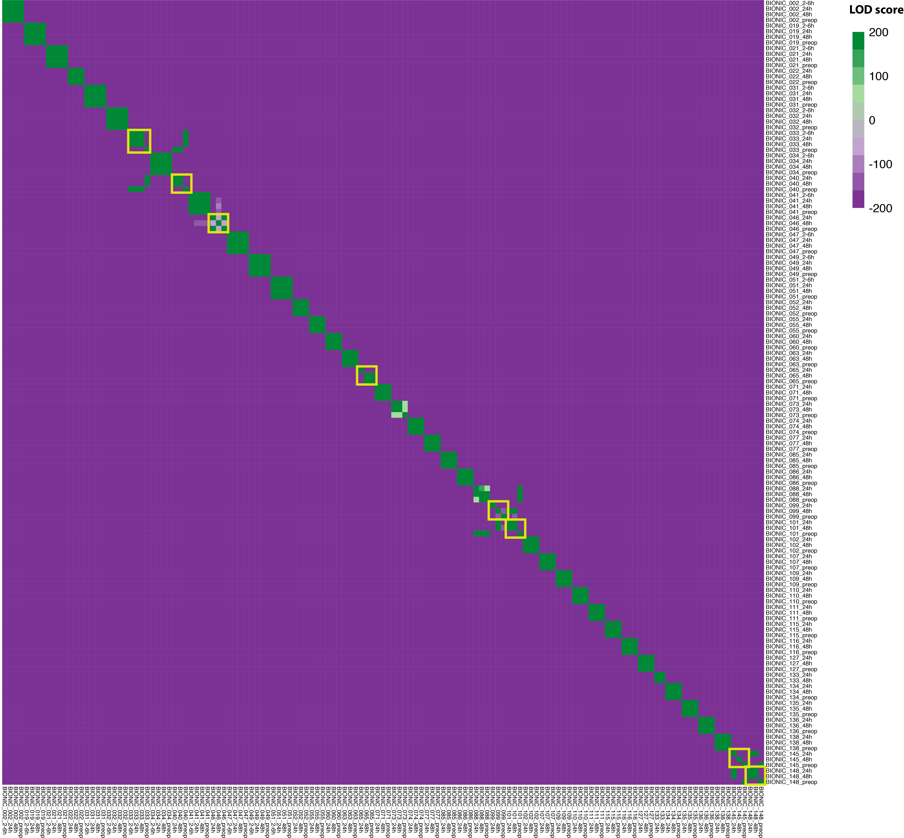

# Sample-identity-CHECK
#### --> based on https://www.nature.com/articles/s41467-020-17453-5

## An example 


### 1. Download pre-compiled haplotype maps for hg19 or hg38. see details in https://github.com/naumanjaved/fingerprint_maps

### 2. Add Readgroups for each sample for pairwise comparisons
```
/apps/well/java/jdk1.8.0_latest/bin/java -Xmx8g -jar \
/apps/well/picard-tools/2.21.1/picard.jar AddOrReplaceReadGroups \
INPUT=Deduplicated.bam/${SAMPLE_NAME}.dedup.bam \
OUTPUT=Deduplicated.bam/${SAMPLE_NAME}.dedup_RG.bam \
RGID=$SAMPLE_NAME \
RGLB=RNAseq \
RGPL=illumina \
RGPU=$SAMPLE_NAME \
RGSM=$SAMPLE_NAME
```
### 3. Collects fingerprints (genotype information from the RNA reads) and run CrosscheckFingerprints.sh
#### the "MATRIX_OUTPUT" file could be used for results visualization refer to 
```
samtools merge -@ 12 BIONIC_merged_RG.bam \
Deduplicated.bam/*.dedup_RG.bam 

/apps/well/java/jdk1.8.0_latest/bin/java -Xmx8g -jar /apps/well/picard-tools/2.21.1/picard.jar CrosscheckFingerprints \
INPUT=BIONIC_148_RG.bam \
HAPLOTYPE_MAP=hg38_chr.map \
NUM_THREADS=4 \
OUTPUT=sample.140.crosscheck_metrics.txt \
MATRIX_OUTPUT=sample.140.crosscheck_LOD_Matrix.txt
```

